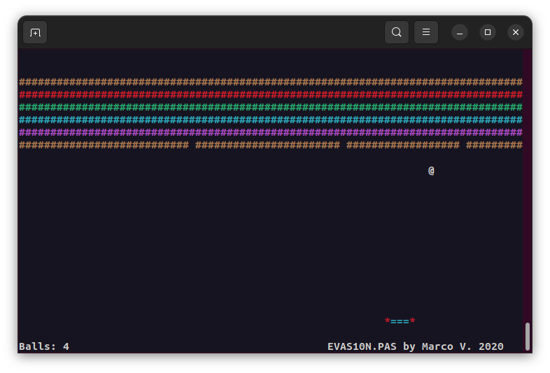

## EVAS10N

Adaptation of [brick-style CP/M game](https://github.com/marcosretrobits/EVAS10N.PAS) for classic CP/M ANSI color or VT102 B/W terminal 80x24.
Game compiled and tested at real CP/M [ZX2022 computer](https://github.com/michalin/ZX2022). 

## Controls

**z** : Move bat left  
**x** : Move bat right  
**any key** : Stop bat
**q** : Quit

## Compiling

You may use and modify source code for your own purpose. Compiling instructions:
* Copy [Turbo Pascal 3](http://www.retroarchive.org/cpm/lang/lang.htm) to target CP/M system.
* Start Turbo Pascal 3.
* Set drive, main file to FLAPCPM.PAS.
* Set compiler options to COM.
* Compile.

## Extra

With a little changes this game might be compiled and run under DOS with Turbo Pascal 5.5 or 7.0. 
Simply add "uses crt", change code for using DOS crt functions. 
